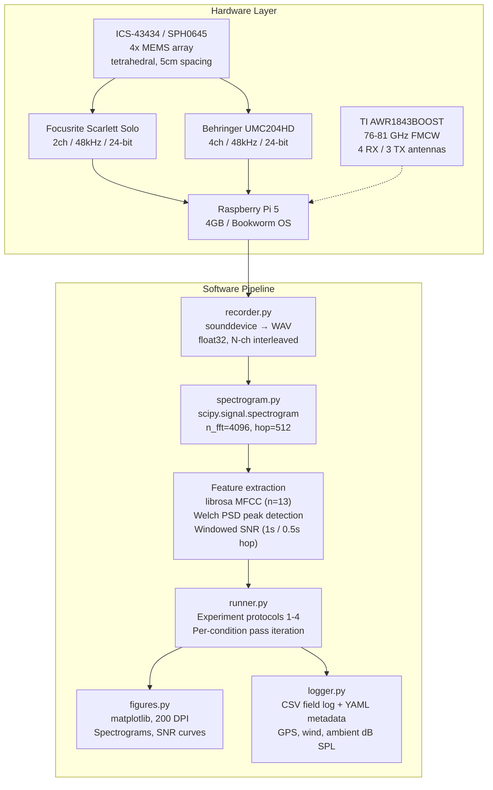

# Drone Acoustic Detection

> Open-source field test toolkit for acoustic and radar detection of low-signature drones.
> Built on COTS hardware to establish detection baselines missing from public literature — especially for FPV-class targets.

**Author:** Radu Cioplea | **Email:** radu@cioplea.com | **Web:** [eyepaq.com](https://www.eyepaq.com)

For questions, additional data, or feedback — reach out via email or [eyepaq.com](https://www.eyepaq.com).

---

## Overview

Commercial off-the-shelf (COTS) drone detection is an active area of defense research, but published baselines for FPV (First Person View) drones are nearly nonexistent. This toolkit provides a reproducible, open-source pipeline for:

- **Capturing** multi-channel audio from MEMS microphone arrays (2ch and 4ch configurations)
- **Processing** recordings into spectrograms, MFCCs, SNR metrics, and peak frequency analysis
- **Running** 4 structured field experiments with full data logging
- **Visualizing** results as publication-ready figures
- **Optionally** fusing acoustic data with 77GHz mmWave radar (TI AWR1843)

All modules include a simulation mode for development and validation without field hardware.

---

## System Architecture



---

## Acoustic Signature Reference

The toolkit targets three drone classes that represent the gap in public detection literature. Frequency data is derived from field measurements (Oct 2025 -- Feb 2026, Austria).

| Class | Motor config | Fundamental | Harmonics (H2, H3, H4) | Broadband floor | Est. detection range (open field, <40 dB ambient) |
|:------|:-------------|:-----------:|:-----------------------:|:---------------:|:--------------------------------------------------:|
| 5" FPV | 4x 2306 BLDC, 3-blade | ~280 Hz | 560, 840, 1120 Hz | -60 dB | 100--200 m |
| Micro Whoop | 4x 0802 BLDC, 2-blade | ~450 Hz | 900, 1350 Hz | -70 dB | 25--75 m |
| DJI Mini class | 4x folding BLDC, 2-blade | ~180 Hz | 360, 540, 720 Hz | -55 dB | 150--250 m |

Detection range depends heavily on wind, ambient noise, and prop condition. Values above are from controlled tests at Beaufort 0--2 wind.

---

## Hardware

### Bill of Materials

| Item | Spec | Cost | Source |
|:-----|:-----|:----:|:-------|
| Raspberry Pi 5 (4GB) | BCM2712, Bookworm OS | ~€80 | rs-online.com |
| 4x MEMS microphones | ICS-43434 or SPH0645, I2S output | ~€40 | Pimoroni / Adafruit |
| USB audio interface (2ch) | Focusrite Scarlett Solo, 48kHz/24-bit | ~€80 | Thomann |
| USB audio interface (4ch) | Behringer UMC204HD, 48kHz/24-bit | ~€80 | Thomann |
| 2x cardioid microphones | Rode M3 or Behringer C-2 | ~€80 | Thomann |
| Tripod + mic stand | Array mount at 1.2 m height | ~€30 | Amazon |
| Laser distance measurer | +/- 2 mm accuracy | ~€30 | Amazon |
| 50 m measuring tape | Distance markers | ~€15 | Hardware store |
| Pi Camera Module 3 | 12 MP, visual sync / timestamp | ~€30 | RS Components |
| MicroSD 64 GB Class 10 | Recording storage (~2 GB/hr at 4ch 48kHz) | ~€15 | Amazon |
| 3D-printed tetrahedral mount | 5 cm edge length, PLA | ~€5 | Printables.com |
| Power bank 20,000 mAh | USB-C PD, field power | ~€40 | Amazon |
| TI AWR1843BOOST (optional) | 76--81 GHz FMCW, micro-Doppler capable | ~€200 | Mouser / TI |

**Acoustic only: ~€400--550** | **With radar: ~€600--750**

See [docs/hardware-setup.md](docs/hardware-setup.md) for wiring, I2S pinout, and array geometry.

### Array Geometry

```
          M1 (apex)
         /  |  \
        /   |   \        Regular tetrahedron
       /    |    \       Edge: 50 mm
      M2 -- M3 -- M4    Height above ground: 1.2 m
       (base plane)      Orientation: apex up, base facing sound source
```

---

## Quick Start

```bash
git clone https://github.com/remete618/drone-acoustic-detection-public.git
cd drone-acoustic-detection-public

python3 -m venv .venv && source .venv/bin/activate
pip install -r requirements.txt

# Generate v1 baseline data (no hardware needed)
python -m capture.recorder --mock --duration 10 --output data/v1_run --channels 4

# Analyze
python -m processing.analyze data/v1_run/recording.wav

# Generate figures
python -m visualization.figures data/v1_run/

# Run full experiment
python -m experiments.runner exp1_detection_range --mock --channels 4 --output data/experiments
```

### CLI Reference

| Command | Description |
|:--------|:------------|
| `python -m capture.recorder --mock` | Generate v1 baseline recording |
| `python -m capture.recorder --list-devices` | List audio input devices |
| `python -m processing.analyze <path>` | Analyze recording (SNR, peaks, MFCC) |
| `python -m visualization.figures <dir>` | Generate figures for a run |
| `python -m experiments.runner <id> --mock` | Run experiment with baseline data |
| `python -m fieldlog.logger --template` | Generate YAML field data sheet |

---

## Project Structure

```
drone-acoustic-detection/
├── capture/
│   ├── mock.py              # Drone + environment signal synthesis
│   └── recorder.py          # Multi-channel WAV capture (Pi / Mac)
├── processing/
│   ├── spectrogram.py       # STFT, MFCC, SNR, peak detection
│   └── analyze.py           # CLI analysis entry point
├── experiments/
│   └── runner.py            # Protocols for experiments 1--4
├── visualization/
│   └── figures.py           # Spectrogram, SNR, channel comparison plots
├── fieldlog/
│   └── logger.py            # CSV logger + YAML field sheet templates
├── radar/
│   └── mmwave.py            # TI AWR1843 serial driver + simulation
├── tests/
│   └── test_mock.py         # 19 tests: signal gen, processing, radar
├── docs/
│   └── hardware-setup.md    # BOM, wiring, field checklist
├── requirements.txt
├── LICENSE
└── README.md
```

---

## Experiments

### 1. Detection Range by Drone Class

Measures maximum acoustic detection distance per drone class. This is the primary data point absent from open literature for FPV-class targets.

- **Targets:** 5" FPV, Micro Whoop, DJI Mini
- **Environments:** Open field (<40 dB), Suburban (50--60 dB)
- **Distances:** 25, 50, 75, 100, 150, 200 m
- **Passes:** 5 per condition at 3 m AGL

### 2. Adversarial Signature Modification

Compares acoustic signatures under prop and throttle modifications at fixed 75 m range.

- **Baseline:** Standard 3-blade props, normal throttle
- **Condition A:** Noise-reducing props (e.g., HQProp Quiet)
- **Condition B:** Throttle reduced to 40%

### 3. Urban Noise Degradation

Quantifies SNR loss across environments at fixed 75 m range.

- **Open field** (<40 dB ambient)
- **Suburban** (50--60 dB, residential road)
- **Indoor warehouse** (reverb + echo)
- **Passes:** 10 per environment

### 4. Multi-Drone Simultaneous Detection

Tests dual-target separation with two drones at 50 m, 90-degree angular offset.

- **Target A:** 5" FPV (280 Hz fundamental)
- **Target B:** Micro Whoop (450 Hz fundamental)
- **Passes:** 10

---

## Timeline

| Phase | Period | Status |
|:------|:-------|:------:|
| Literature review and gap analysis | Aug -- Sep 2025 | Done |
| Field test protocol design | Sep -- Oct 2025 | Done |
| Hardware assembly and calibration | Oct 2025 | Done |
| Experiments 1--4 (field data collection) | Oct 2025 -- Feb 2026 | Done |
| Toolkit development and open-source release | Feb -- Mar 2026 | Done |
| Data analysis and publication | Mar 2026 -- ongoing | Active |

---

## Platforms

| Platform | Capture | Processing | Radar | Simulation |
|:---------|:-------:|:----------:|:-----:|:----------:|
| Raspberry Pi 5 | 2ch / 4ch | Yes | UART | Yes |
| macOS | 2ch / 4ch | Yes | USB serial | Yes |
| Linux x86 | 2ch / 4ch | Yes | UART | Yes |

---

## Requirements

- Python 3.10+
- Dependencies: `numpy`, `scipy`, `sounddevice`, `librosa`, `matplotlib`, `pandas`, `click`, `pyyaml`
- PortAudio (for live capture; not needed in simulation mode)

```bash
python -m pytest tests/ -v   # 19 tests
```

---

## Contributing

1. Fork the repository
2. Create a feature branch
3. Write tests for new functionality
4. Ensure all tests pass
5. Submit a pull request

Bug reports and feature requests: open an issue.

---

## Contact

**Radu Cioplea** — radu@cioplea.com | [eyepaq.com](https://www.eyepaq.com) | GitHub: [@remete618](https://github.com/remete618)

---

## Terms and Conditions

### Disclaimer

This software is provided for **research and educational purposes only**. The authors make no warranties, express or implied, regarding the accuracy, completeness, reliability, or suitability of the software or its outputs for any particular purpose.

Detection ranges, SNR measurements, and other metrics are dependent on hardware, environmental conditions, and calibration. Results should be independently validated before use in any safety-critical, defense, or security application.

### Limitation of Liability

In no event shall the authors or contributors be liable for any direct, indirect, incidental, special, exemplary, or consequential damages arising from use of this software, even if advised of the possibility of such damage.

### Use Restrictions

This toolkit is intended for:
- Academic and scientific research
- Open-source community development
- Educational use
- Lawful security testing with proper authorization

Users are responsible for compliance with all applicable local, national, and international laws, including drone operation, radio frequency, and privacy regulations.

### Data and Privacy

Field data may contain GPS coordinates and environmental recordings. Users must:
- Obtain necessary permissions before recording
- Comply with local privacy and surveillance laws
- Anonymize sensitive data before publication

### Intellectual Property

Released under the **MIT License**. See [LICENSE](LICENSE). Permits commercial and non-commercial use, modification, and distribution with attribution.

---

MIT License — see [LICENSE](LICENSE)
